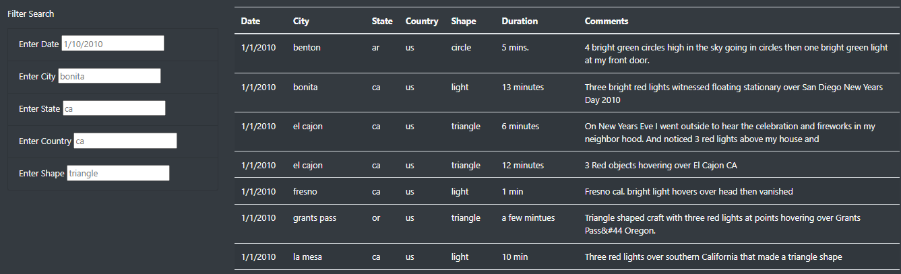
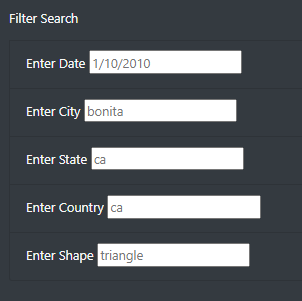
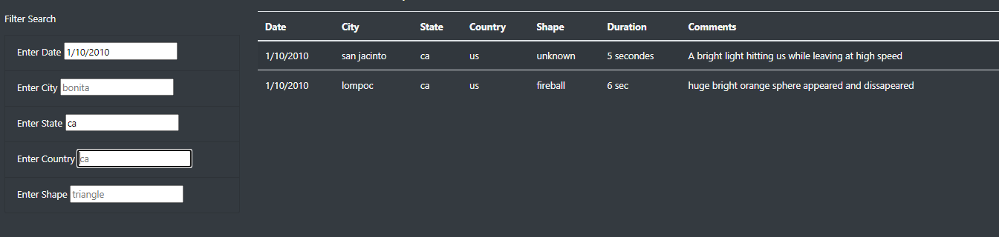

# UFO
## Overview of the Analysis
The purpose of the project is to use javascript functions (normal and arrow functions), html and css to help create a filterable webpage to visually showcase the data.  
### Tools and data
- Data: [data.js](static/js/data.js)
- Software:
 - Javascript
 - html
 - css

## Using the webpage
The webpage is user friendly and has a quick link right at the top of the page which the user to click to go back to the inital view (like a refresh button). See image below, the place to click is highlighted in yellow with a blue border.  
  

The next interactive thing are the filters. The filters are neatly present with some values which provide a guideline as to how the values need to be filled.  
  
**_Please note: The grayed out values in the filter are just for representation and they do not currently filter anything within the table._**  
  
Using the filters is fairly simple, you can type the values and once you press enter or tab to move to the next filter, the values in the table get filtered automatically.IN the below image only the date and the state filters are applied.  
  

## Summary and suggested improvements
While the current webpage is a great first step in creating an interactive webpage, there are some small changes which can be made to imporve the user experience
1. Filters should be drop-down boxes as opposed to open text fields
 - This will ensure that the users do not type random values which do not exist in the data file
2. Ability to save a filtered view.
 - Users might want to use same or similar views and the ability to save a view for further analysis will help them in this regard

